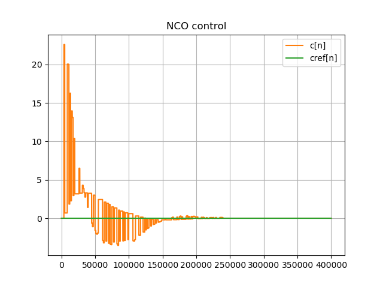
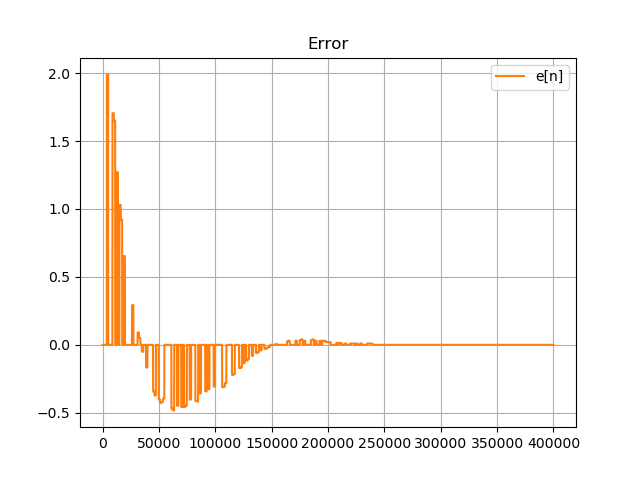

**The author:** ***Dr.Janos Selmeczi, HA5FT***. You could reach me at <ha5ft.jani@freemail.hu>
***
# Bit recovery with phase step and random bit sequence

Following you find the results of the bit recovery random bitsequence and phase step scenario

dteta=1 rad

Go back to the [BitRecoveryTest page](test_BitRecoveryTest.md)\
Go back to the [start page](../README.md)

