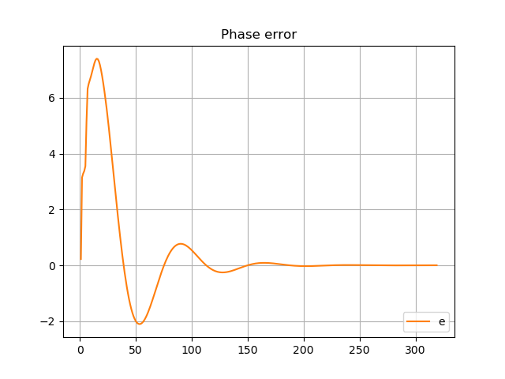
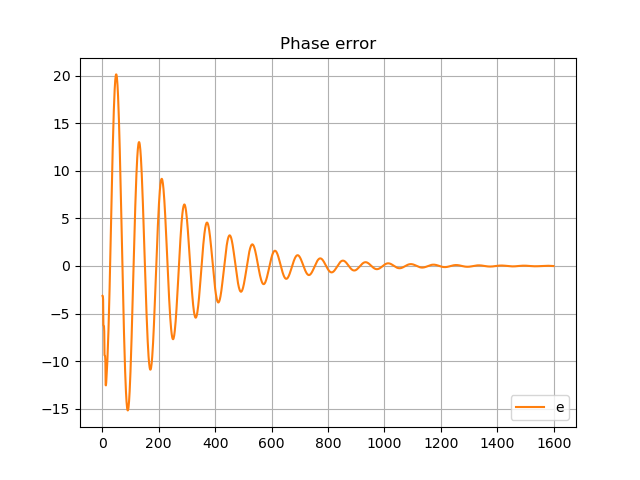
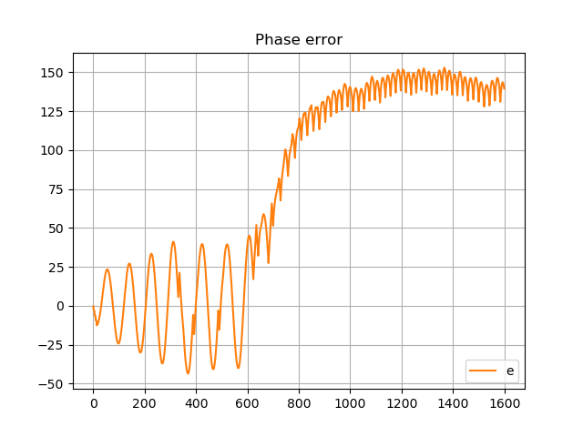

**The author:** ***Dr.Janos Selmeczi, HA5FT***. You could reach me at <ha5ft.jani@freemail.hu>
***
# The effect of delay in the loop

Following you find the results of the effect of delay in the loop scenario

**2 sample delay**

**10 sample delay**

**14 sample delay**

**16 sample delay**

Go back to the [PLLorCostasLoopTest page](test_PLLorCostasLoopTest.md)\
Go back to the [start page](../README.md)
