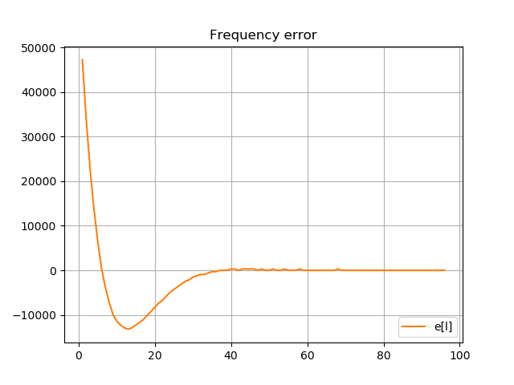
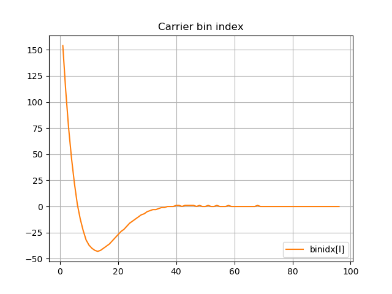
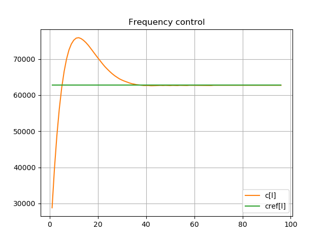
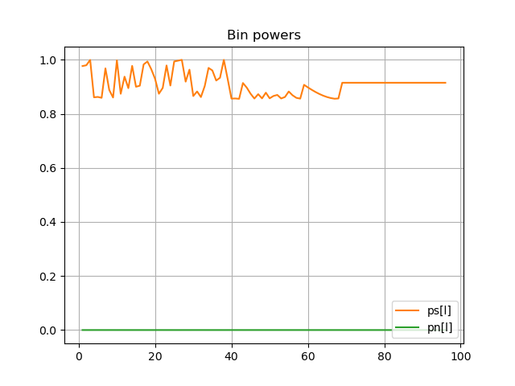

**The author:** ***Dr.Janos Selmeczi, HA5FT***. You could reach me at <ha5ft.jani@freemail.hu>
***
# Frequency locked loop first experience scenario

Following you find the results of scenario

**BL=4 df=1e4**

**Frequency error**

**index of bin containing the carrier**

**NCO control**

**signal and average noise power**

Go back to the [BitRecoveryLoopTest page](test_BitRecoveryLoopTest.md)\
Go back to the [start page](../README.md)
