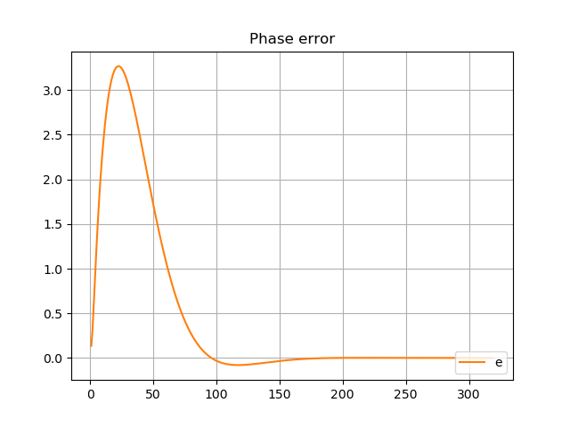
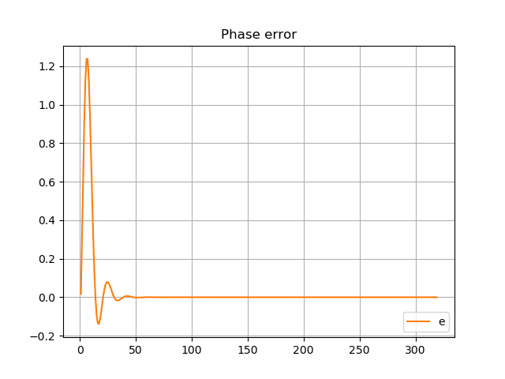
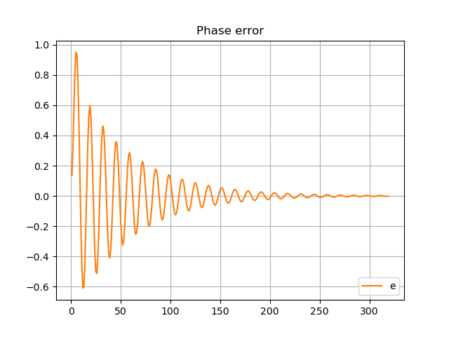
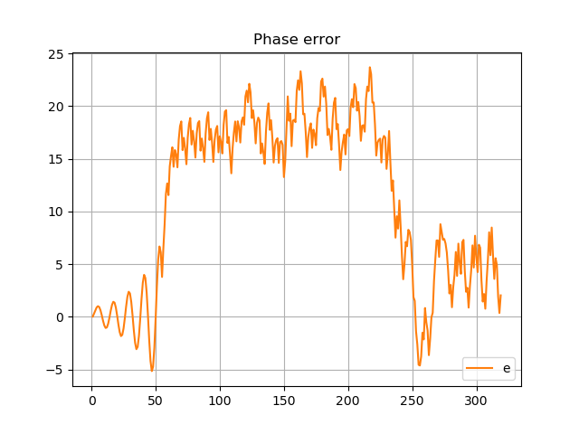

**The author:** ***Dr.Janos Selmeczi, HA5FT***. You could reach me at <ha5ft.jani@freemail.hu>
***
# Loop bandwidth and delay

Following you find the results of the loop bandwidth and delay scenario

**BL=4Hz**

**BL=16Hz**

**BL=24Hz**

**BL=28Hz**

Go back to the [PLLorCostasLoopTest page](test_PLLorCostasLoopTest.md)\
Go back to the [start page](../README.md)
