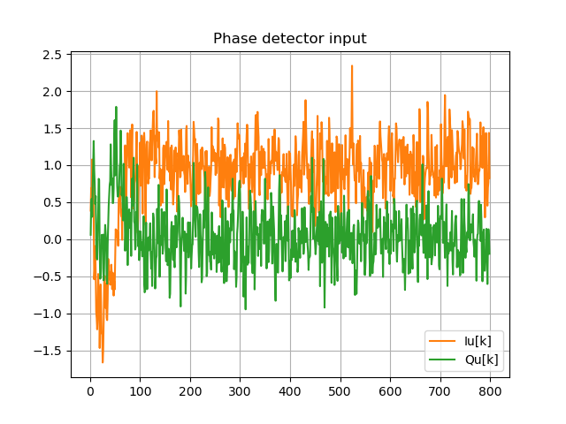
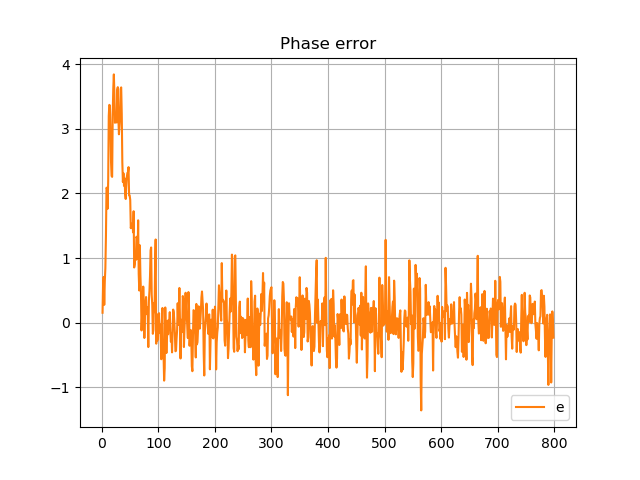
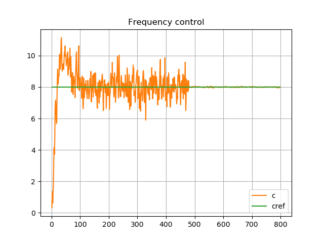

**The author:** ***Dr.Janos Selmeczi, HA5FT***. You could reach me at <ha5ft.jani@freemail.hu>
***
# Linear frequency change

Following you find the results of the loop bandwidth change scenario

**BL=4 changed to BL=0.125**

**phase detector input**

**phase error**

**NCO control**

Go back to the [PLLorCostasLoopTest page](test_PLLorCostasLoopTest.md)\
Go back to the [start page](../README.md)
