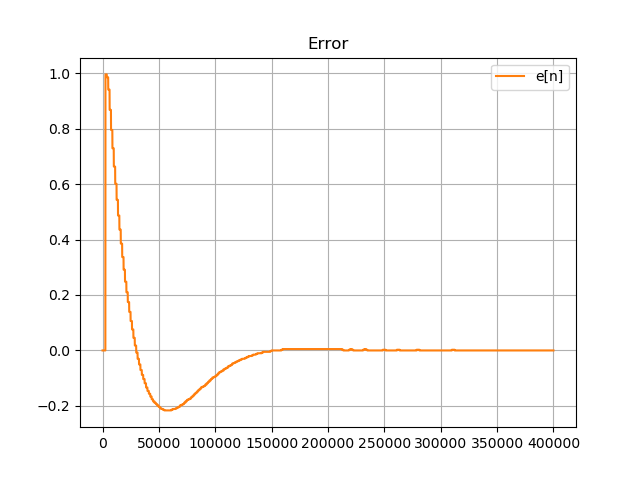
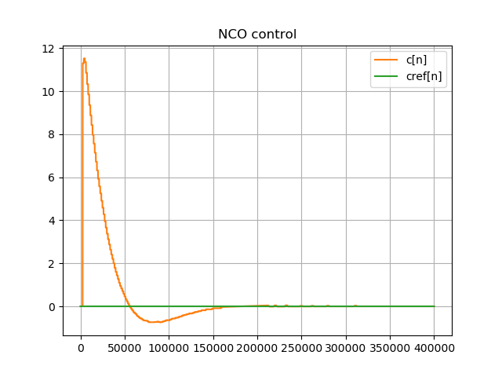

**The author:** ***Dr.Janos Selmeczi, HA5FT***. You could reach me at <ha5ft.jani@freemail.hu>
***
# Trying the FrequencyLockedLoopTest class

This class is a test bench for the FrequencyLockedLoop class.
In addition of the test instance of the FrequencyLockedLoop class it implements
* a rectangular pam pulse generator,
* a square wave NCO to control the bit frequency
* a noise generator,
* channel simulator which adds noise to the carrier,
* signal visualization functions for checking signals in the test as well as in the loop class.

## Run your first simulation

You could run an instance of the class from the python3 consol. You shoud run it from a ***command terminal in the pllpy directory***.
```bash
# start the sdrflow runtime_application
> python3
Python 3.8.10 (default, Mar 15 2022, 12:22:08)
[GCC 9.4.0] on linux
Type "help", "copyright", "credits" or "license" for more information.
>>>
```
Now you are in python console and you could use it for the testing
```python
# You are in the python3 console
# First you have to import the code of the class
>>> from tests import *
>>> test=BitRecoveryLoopTest(200000, 160, 10000000, bmode=1, threshold=1e-2)
>>> test.run(400000,  4,  65.6, dteta=1.0, df=0.0, Gs=1.0, Gn=0.0, openloop=0)
BL = 4
phiPM = 75.5
Kp = 12.71236013136441
Ki = 0.02056418737831563
...............................
n = 400000
k = 320
t = 2.0
exec time = 21.44137454032898
>>> test.show_error(0,400000)
n rate sample range : 0 : 400000
```
At this point you should se the following 4 diagramms




After you close the diagramm windows

```python
>>> exit()
# You left the python3 consol and you are back in the linux shell
>
```

## Printouts on the python console

You have simula 2 second and the simulatur run 21.4 sec. So it is an order of magnitude slower than real time.
The run() function printed on the consol
* BL, the SSB noise bandwidth
* phiPM, the phase margin
* Kp, the computed proportional gain
* Ki, the computed integrator gain divided by the proportional gain
* a series of c characters showing that closed loop simulation is running without sweep
* n, the number of input samples used in the simulation
* k, the number of decimated sample at the frequency detector output
* t, the time length of the simulation
* exec time, the execution time of the simulation

## Parameters of the simulation

The important parameters of the simulation:
|Parameter|Value|Description|
|---------|-----|-----------|
|fs|2e5Hz|sampling rate|
|f0|160Hz|bit frequency|
|bmode|1|-1,1,-1,1,... bit sequence|
|BL|4Hz|SSB noise bandwidth|
|phiPM|65.6|phase margin|
|dteta|1.0|phase step|


Go back to the [get started page](get_started.md)\
Go back to the [start page](../README.md)
