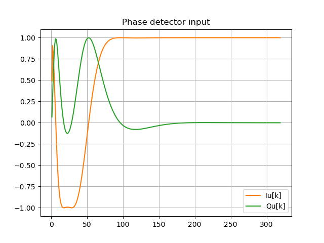
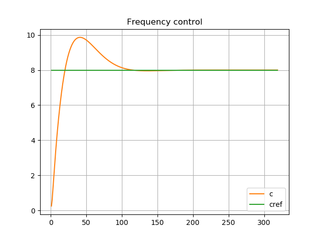

**The author:** ***Dr.Janos Selmeczi, HA5FT***. You could reach me at <ha5ft.jani@freemail.hu>
***
# Trying PLLorCostasLoopTest class
This class provide test environment for the PLLorCostaLoop class. It implements:
* a carrier generator,
* a sweep generator which generates frequency sweep control signal for the carrier generator,
* a baseband rectangular PAM signal generator for BPSK or QPSK modulation,
* a BPSK modulator (QPSK modulatorm will be added later),
* a noise generator,
* channel simulator which adds noise to the carrier,
* signal visualization functions for checking signals in the test as well as in the loop class.

## Run your first simulation

You could run an instance of the class from the python3 consol. You shoud run it from a ***command terminal in the pllpy directory***.

```bash
# start the sdrflow runtime_application
> python3
Python 3.8.10 (default, Mar 15 2022, 12:22:08)
[GCC 9.4.0] on linux
Type "help", "copyright", "credits" or "license" for more information.
>>>
```
Now you are in python console and you could use it for the testing

```python
# You are in the python2 console
# First you have to import the code of the class
>>> from test import *
# You have to create an instance of the class
>>> test=PLLorCostasLoopTest(2e5, 1e4, 1250, 4096, 20, 0.025, 1000,  40.0,    2e7, lfsel=0, pdtype=0, bmode=1, mu=1.0)
PLLorCostasLoop: Type2 loop filter
>>> test.run( 400000,  4,  65.6, M=1, dteta=0.0, df=8.0, Gs=1.0, Gn=0.0, startsw=0, swmode=0, pdmode=0, openloop=0)
BL = 4
phiPM = 65.6
Kp = 11.007002311039455
Ki = 0.0312062355560034
cccccccccccccccccccccccccccccccc
n = 400000
k = 320
t = 2.0
exec time = 19.218185663223267
>>> test.show_loop(0,400000)
n rate sample range = 0 : 400000
k rate sample range = 1 : 320
```
At this point you should see the following 3 diagramms





After you close the diagramm windows

```python
>>> exit()
# You left the python3 consol and you are back in the linux shell
>
```

## Printouts on the python console

In the simulation you used a PLL to lock in an unmodulated carrier.
You simulated 2 second and the simulatur run 19.2 sec. So it is an order of magnitude slower than real time.
The run() function printed on the consol
* BL, the SSB noise bandwidth
* phiPM, the phase margin
* Kp, the computed proportional gain
* Ki, the computed integrator gain divided by the proportional gain
* a series of c characters showing that closed loop simulation is running without sweep
* n, the number of input samples used in the simulation
* k, the number of decimated sample
* t, the time length of the simulation
* exec time, the execution time of the simulation

## Parameters of the simulation

The important parameters of the simulation:
|Parameter|Value|Description|
|---------|-----|-----------|
|fs|2e3Hz|sampling rate|
|f0|1e4Hz|carrier frequency|
|df|8Hz|frequency step|
|N|1250|decimation factor|
|BL|4Hz|SSB noise bandwidth|
|phiPM|65.6|phase margin|
|lfsel|0|type2 loop filter|

Go back to the [get started page](get_started.md)\
Go back to the [start page](../README.md)
